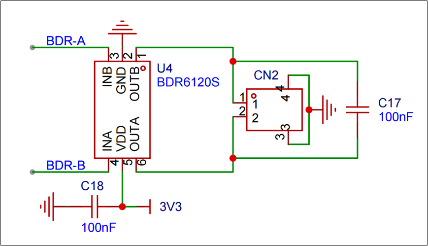

# 02. 硬件选型

#  主控芯片
主控芯片我们采用的是ESP32-C3芯片。

（1）安全、低功耗、低成本的 RISC-V MCU

（2）支持 2.4 GHz Wi-Fi 和 Bluetooth 5 (LE)

（3）满足各类常见的物联网产品功能需求

乐鑫官方提供了开发用的SDK, 使用ESP32芯片开发各种应用难度大大降低,即使不懂底层硬件工作原理,也能高效的开发出各种应用。

# 蓝牙模块
使用esp32内置的蓝牙模块

# WIFI模块
使用esp32内置的wifi模块

# 触摸感应器
**SC12B**, 12按键带自校正功能的容性触摸感应器. 可以检测 12 个感应键盘是否被触摸。它可以通过任何非导电介质（如玻璃和塑料）来感应电容变化。这种电容感应的开关可以应用在很多电子产品上，提高产品的附加值。

ESP32通过I2C通讯连接触摸感应器。

## 原理图

# 单总线全彩LED
[https://components.espressif.com/](https://components.espressif.com/)

WS2812B-2020是一个集控制电路与发光电路于一体的智能外控LED光源；其外型采用最新的molding封装工艺，将IC与发光芯片封装在一个2020的封装尺寸中，每个元件即为一个像素点；像素点内部包含了智能数字接口数据锁存信号整形放大驱动电路，还包含有高精度的内部振荡器和可编程定电流控制部分，有效保证了像素点光的颜色高度一致。

数据协议采用单线归零码的通讯方式，像素点在上电复位以后，DIN端接受从控制器传输过来的数据，首先送过来的24bit数据被第一个像素点提取后，送到像素点内部的数据锁存器，剩余的数据经过内部整形处理电路整形放大后通过DO端口开始转发输出给下一个级联的像素点，每经过一个像素点的传输，信号减少24bit；像素点采用自动整形转发技术，使得该像素点的级联个数不受信号传送的限制，仅受限信号传输速度要求；

高达 2KHz的端口扫描频率，在高清摄像头的捕捉下都不会出现闪烁现象，非常适合高速移动产品的使用；

280μs以上的RESET时间，出现中断也不会引起误复位，可以支持更低频率、价格便宜的MCU；

LED具有低电压驱动、环保节能、亮度高、散射角度大、一致性好超、低功率及超长寿命等优点。将控制电路集成于LED上面，电路变得更加简单，体积小，安装更加简便

## 原理图

# 指纹采集
**HLK-FPM383F**是一款新型面阵式半导体指纹模组, 与市面上已有产品对比, 该模组具有体积小,功耗低,识别速度快, 识别准确度高等优势。

使用方便, 尤其适合应用于门锁, 读卡器和保险箱等体积较小, 使用电池供电的设备中. 低功耗的同时可以保持优异的反应性能及高速的识别速度。

官方驱动参考代码:

[fpc383串口的使用教程 - Hi-Link问答](https://ask.hlktech.com/question/1400.html)

## 原理图

## 一些术语解释
（1）模块         FPM383 是一个模块，它包含传感器、处理器、存储器等组件，能够独立执行指纹识别相关的操作。

（2）指纹图像   这是通过指纹传感器获取的原始指纹图像。传感器会将手指的纹路捕捉为图像数据，通常这个过程叫做“采集指纹图像”。

（3）特征提取    指从采集到的指纹图像中提取出具有代表性的细节点（如分叉点和终止点）信息，这些细节点被称为“指纹特征”。

（4）指纹模板    指纹模板是指纹特征数据的抽象表示，它包含指纹的关键特征点，供后续比对使用。每个指纹模板可以存储在模块的内部存储器中。

（5）模板 ID     每个指纹模板在模块中都有一个唯一的 ID 标识符，用于区分不同的指纹。模板 ID 是指纹存储、比对、删除操作中的关键参数。

（6）比对        比对是指将当前采集到的指纹特征与已经存储在模块中的指纹模板进行对比，以确定指纹是否匹配。比对通常会返回一个匹配度（通常是一个信任值）。

（7）信任值（相似度）      在指纹比对过程中，信任值表示当前指纹与已存储模板的匹配程度。通常信任值越高，匹配度越高，意味着指纹更可能是同一个人的。

（8）录入        录入是指将一个新指纹注册到模块中，成为可以用于比对的指纹模板。通常需要多次采集相同的指纹，以确保模板的准确性。

（9）包错误     在模块和主控板之间的通信中，如果数据包传输过程中出现错误（如数据丢失或损坏），则会产生包错误。包错误可能导致指纹操作失败。

# 语音模块
WTN6 系列为多功能，低功耗，高性能的 CMOS 语音芯片。现有 WTN6040、WTN6096、WTN6170 三种芯片（语音长度分别为 40s、96s、170s）， WTN6040、WTN6096、WTN6170 已投入市场。音频采样率目前最高可达 32kHz，16 级音量控制，两种音频输出方式 PWM 输出和 DAC 输出。精准的+/-1%内部震荡，不需要加外部震荡，具备超低功耗待机。

## 原理图

# 直流电机驱动
BDR6120S 是一款直流有刷电机驱动 IC，适用于电子锁、电动牙刷、玩具、消费类产品以及其它低压或者电池供电运动控制产品

## 原理图

