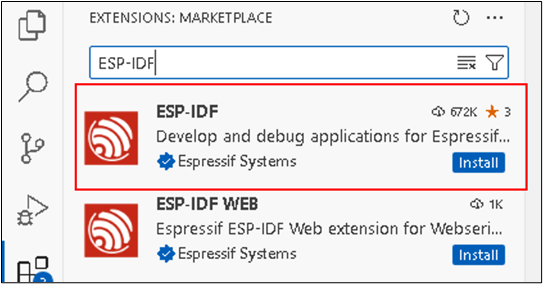

# 03.ESP32开发环境搭建

# ESP-IDF 介绍
ESP-IDF (Espressif  IoT  Development  Framework)是乐鑫 ESP32 开发的一套框架，

乐鑫所研发的软件开发环境 ESP-IDF 能够帮助用户快速开发物联网 (IoT) 应用，满足用户对于 Wi-Fi、蓝牙、低功耗等性能的需求。

框架里面包含**<font style="color:red;">很多例程</font>**，是入门和进阶 ESP32 的**<font style="color:red;">优秀参考</font>**。

开发一款芯片的应用程序需要有一套能够编译自己写的应用程序的**<font style="color:red;">工具链</font>**.

类似**<font style="color:red;">STM32</font>**单片机开发使用**<font style="color:red;">keil</font>**，keil 内部已经集成好了编译链，不用设置即可使用，写好应用程序，点击编译按钮即可生成可下载到 STM32 单片机的文件。

乐鑫的**<font style="color:red;">ESP32</font>**不同，他**<font style="color:red;">没有</font>**类似 keil这样的**<font style="color:red;"> IDE </font>**工具，但是官方提供了编译工具链，用户可以使用任何编辑工具（我们使用的是**<font style="color:red;">Visual Studio Code, </font>****<font style="color:red;">以下简称</font>****<font style="color:red;">vscode</font>**），写好应用程序，使用官方提供的编译工具链进行<font style="color:red;">交叉编译</font>，生成可以运行在 ESP32 上的文件。

# 搭建开发环境
## 下载ESP-IDF离线安装包
下载地址: [https://dl.espressif.cn/dl/esp-idf/?idf=4.4](https://dl.espressif.cn/dl/esp-idf/?idf=4.4)


## 安装ESP-IDF


<font style="color:red;">如果有提示</font><font style="color:red;">”</font><font style="color:red;">应用修复</font><font style="color:red;">”, </font><font style="color:red;">先点击</font><font style="color:red;">”</font><font style="color:red;">应用修复</font><font style="color:red;">”,</font><font style="color:red;">再点击下一步</font>


<font style="color:red;">只保留</font><font style="color:red;">esp32-c3</font><font style="color:red;">和</font><font style="color:red;">esp32-s3,</font><font style="color:red;">其他的可以清除</font>


耐心等待安装完成


## 给vscode安装ESP-IDF插件
在vscode插件市场搜索ESP-IDF, 然后点击Install安装插件



## 使用ESP插件配置ESP环境
在vscode中, 点击菜单View->Command Palette


然后输入: Configure esp, 然后选择第一项


等待10s左右会进入如下界面


点击EXPRESS进入配置界面


点击Install, 然后等待安装完成即可


## 注意：安装报错
如果在安装的过程中报错"c:\Espressif\tools\idf-python\3.11.2\python.exe -m pip" is not valid. (ERROR_INVALID_PIP), 则去esp-idf的安装目录:c:\Espressif\tools, 把idf-python目录删除, 然后再点Install重新安装即可。

# 第一个HelloWorld项目
## 创建项目


或者打开对应的目录,用vscode直接打开也可以。

## 修改代码
在main.c中添加如下代码

```c
#include<stdio.h>
#include"esp_task.h"
void app_main(void)
{
    while (1)
    {
        printf("hello atguigu\r\n");
        
        vTaskDelay(1000);
    }
}
```

**<font style="color:red;">说明 </font>**** <font style="color:red;">: </font>**

（1）esp32-idf与freertos深度绑定,程序启动时,会启动一个app主任务,这里的app_main函数就是主任务的函数. 注意函数名是固定的,不能更改。

（2）可以把这个函数作为入口函数, 来创建其他任务

（3）与普通的 FreeRTOS 任务（或嵌入式 C 的 main 函数）不同，app_main 任务可以返回。如果 app_main 函数返回，那么主任务将会被删除。系统将继续运行其他的 RTOS 任务。

（4）因此可以将 app_main 实现为一个创建其他应用任务然后返回的函数，或主应用任务本身。

## 编译运行


## 监控串口输出结果


  

如果能看到串口输出结果,证明Helloworld成功执行!


