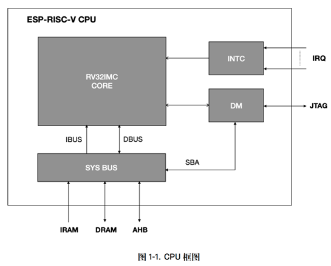

# ESP32-C3介绍

#  RISC-V指令集
ESP-RISC-V CPU 是基于 RISC-V ISA 的 32 位内核，包括基本整数 (I)，乘法/除法 (M) 和压缩 (C) 标准扩展。ESPRISC-V CPU 内核具有 4 级有序标量流水线，针对面积、功耗、性能等进行了优化。

CPU 内核架构包含中断控制器 (INTC)、调试模块 (DM) 和用于访问存储器和外设的系统总线 (SYS BUS) 接口。

时钟频率高达**160MHz**

# 存储器
ESP32-C3是一个超低功耗和高度集成的系统，它集成了一颗RISC-V32位单核处理器，四级流水线架构，主频高达160MHz。所有的内部存储器、外部存储器以及外设都分布在CPU的总线上。

（1）384KB内部ROM

（2）4MB 的内部Flash(ESP32-C3FN4)

（3）400KB内部SRAM

（4）8KB RTC存储器

# IO复用和GPIO交换矩阵
ESP32-C3芯片有**22**个物理通用输入输出管脚(GPIOPin)。每个管脚都可用作一个通用IO，或连接一个内部的外设信号。

利用GPIO交换矩阵和IOMUX，可配置**外设模块的输入信号来源于任何的****IO****管脚**，并且**外设模块的输出信号也可连接到任意****IO****管脚**。这些模块共同组成了芯片的IO控制。

# 一些数字外设
## 串口
ESP32-C3有2组串口可用

##  SPI
ESP32-C3芯片集成了三个SPI控制器：SPI0, SPI1和GP-SPI2

##  I2C
只有一个I2C外设, 但它依然可以作为 I2C 主设备或从设备来连接多个 I2C 设备.

##  红外遥控(RMT)
RMT（红外收发器）是一个红外发送和接收控制器，支持多种红外协议。RMT模块可以实现将模块内置RAM中的脉冲编码转换为信号输出，或将模块的输入信号转换为脉冲编码存入RAM中。此外，RMT模块可以选择是否对输出信号进行载波调制，也可以选择是否对输入信号进行解调和去噪处理。

##  ADC
两个12位逐次逼近型模拟数字转换器(SARADC)：SARADC1和SARADC2，共支持六个通道的模拟信号检测

温度传感器：用于测量ESP32-C3芯片内部温度。

