# 蓝牙开锁

#  蓝牙基础知识
## 蓝牙概述
蓝牙，是一种利用低功率无线电，支持设备短距离通信的无线电技术，能在包括移动电话、PDAQ、无线耳机、笔记本电脑、相关外设等众多设备之间进行无线信息交换，蓝牙工作在全球通用的2.4 GHz（2.4 至 2.485 GH）ISM（即工业、科学、医学）频段，使用IEEE802.11协议。

## 蓝牙产生背景
1998年5月，爱立信、诺基亚、东芝、BM和英特尔公司等五家著名厂商，在联合开展短程无线通信技术的标准化活动时提出了蓝牙技术，其宗旨是提供一种**<font style="color:#FF0000;">短距离、低成本</font>**的无线传输应用技术。芯片霸主Intel公司负责半导体芯片和传输软件的开发，爱立信负责无线射频和移动电话软件的开发，IBM和东芝负责笔记本电脑接口规格的开发。 1999年下半年，著名的业界巨头微软、摩托罗拉、三星、朗讯与蓝牙特别小组的五家公司共同发起成立了蓝牙技术推广组织，从而在全球范围内掀起了一股“蓝牙”热潮。

全球业界即将开发一大批蓝牙技术的应用产品，使蓝牙技术呈现出极其广阔的市场前景，并预示着21世纪初将迎来波澜壮阔的全球无线通信浪潮。

## 蓝牙发展历程
自1994年由爱立信推出至今，蓝牙技术已经走过了30个岁月，发展为当前的状况。

**<font style="color:#FF0000;">第一代蓝牙：</font>**关于短距离通讯早期的探索，使用的是BR（Basic Rate）技术，此时蓝牙的理论传输速率，只能达到721.2Kbps。

**<font style="color:#FF0000;">第二代蓝牙：</font>**新增的EDR（Enhanced Data Rate）技术，使得蓝牙设备的传输率可达3Mbps。

**<font style="color:#FF0000;">第三代蓝牙</font>**<font style="color:#FF0000;">：</font>核心是AMP（Generic Alternate MAC/PHY），这是一种全新的交替射频技术，支持动态地选择正确射频，传输速率高达24Mbps。

**<font style="color:#FF0000;">第四代蓝牙：</font>**主推Low Energy低功耗，BLE（Bluetooth Low Energy）低功耗功能。

**<font style="color:#FF0000;">第五代蓝牙</font>**<font style="color:#FF0000;">：</font>开启物联网时代大门，在低功耗模式下具备更快更远的传输能力。

## 蓝牙技术类型
蓝牙协议包括两种技术：BR（Basic Rate）和LE（Low Energy）。

这两种技术都包括搜索（discovery）管理、连接（connection）管理等机制，但它们是相互独立的，不能互通的技术！

厂商如果只实现了一种，那么只能与同样实现该技术的设备互通。如果厂商要确保能和所有的蓝牙设备互通，那么就只能同时实现两种技术，而不去管是否真的需要。

### 经典蓝牙（BR/EDR和AMP）
BR：Basic Rate是正宗的蓝牙技术，可以包括可选的EDR（Enhanced Data Rate）技术，以及AMP（Alternate MAC and PHY layer extension）。

BR：最早期的蓝牙技术，速度只能达到721.2Kbps，在那个年代，已为高大上了。·EDR：随着技术的提升，使用EDR技术的蓝牙，理论速率可以达到2.1Mbps。

AMP：使用AMP技术的蓝牙，理论速率可以达到24Mbps。蓝牙自身的物理层和AMP技术差异明显，BR/EDR和AMP是不能同时使用的。简单的说，就是：BR和EDR是可以同时存在的，但BR/EDR和AMP只能二选一。

### 低功耗蓝牙（BLE）
上面所讲的BR技术的进化路线，就是传输速率的加快、加快、再加快。但能量是守恒的，你想传得更快，代价就是消耗更多的能量。而有很多的应用场景，并不关心传输速率，反而非常关心功耗。这就是Bluetooth LE（称作蓝牙低功耗）产生的背景。

低功耗蓝牙与经典蓝牙使用相同的2.4GHz无线电频率，因此双模设备可以共享同一个天线。低功耗蓝牙使用的调制系统更简单。BLE技术相比BR技术，差异非常大，或者说就是两种不同的技术，凑巧都加一个“蓝牙”的前缀而已。目前BLE主要广泛应用于IoT（Internet of Things：物联网）产品领域。

## 市场上常见蓝牙架构
### SOC蓝牙单芯片方案
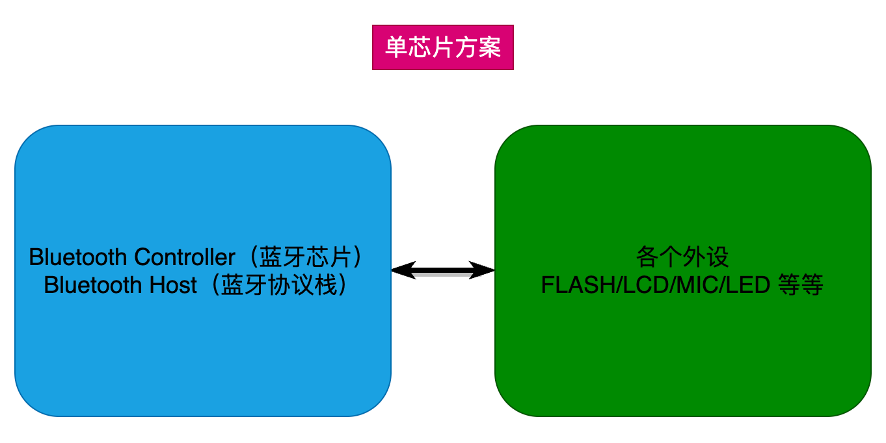

一般是半导体厂商半开源协议栈，把开发的蓝牙协议栈直接烧写到蓝牙芯片中（比如CSR BC4/5、CSR8670、CSR8675、T1CC2540、NRF51xXx、NRF52XXx、**<font style="color:#FF0000;">乐鑫ESP32</font>**等等）。

此类芯片一般可以直接做为MCU用，这类产品一般用于消费类电子，集成度很高，调一调参数可以直接使用，常见的有蓝牙耳机等产品。

### SOC蓝牙+MCU方案
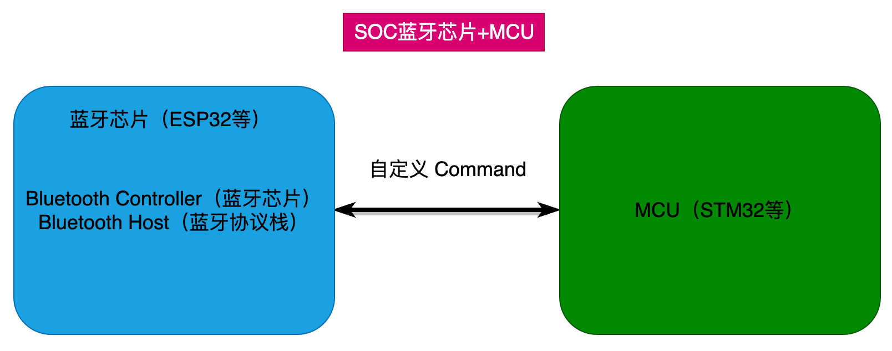

在集成好的蓝牙芯片基础上，通过特定的接口（UART居多），发送自定义的command来达到想要的功能，比如发送0x01代表搜索周围设备。

外设一个单芯片方案，其自定义指令包含蓝牙芯片（BT Controller）、微控制单元（MCU）以及蓝牙协议栈（BT Host）。

此部分的应用，将蓝牙作为一个外设使用，用于远程通信，例如网上卖的一些蓝牙串口。

比如我们后面应用就是采用的这种方案。 STM32作为MCU使用，ESP32作为蓝牙芯片使用。

### 蓝牙host+controller分开方案
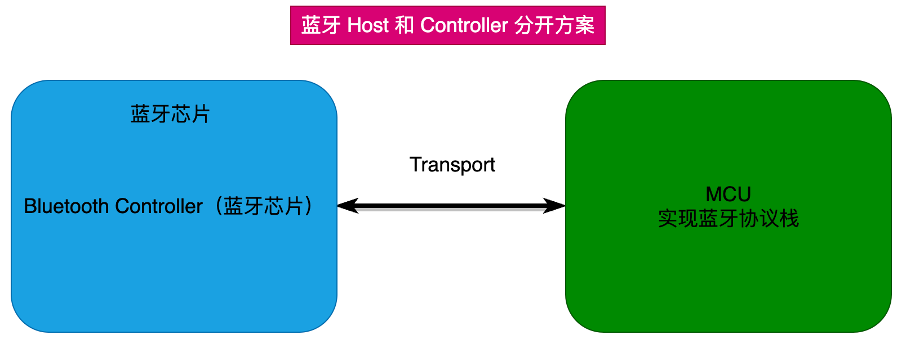

这种应用算是蓝牙最复杂的应用，客户需要使用蓝牙的场景有很多，涉及的蓝牙协议也有很多，需要将Host与Controller分开，集成更多的蓝牙协议，比如蓝牙电话（HFP）、蓝牙音频（A2DP）、蓝牙音乐控制（AVRCP）、蓝牙电话本（PBAP）、蓝牙短信（MAP）等。

此部分应用，将定制蓝牙的各种服务，实现蓝牙多功能需求。

### 使用场景
介绍几种使用场景，帮助理解。

手机。手机的蓝牙复杂应用，注定要用第3种方案，也就是蓝牙协议栈在主芯片中，蓝牙芯片为HC架构。

蓝牙音响、蓝牙耳机此种应用。一般用单芯片方案就能搞定，好处在于开发便捷。

蓝牙手表。手表要看功能复杂性，如果仅仅有时间显示、传感器交互、蓝牙，那么可以选择单芯片方案（也就是方案1），如果有网络等比较复杂的功能就要使用MCU+蓝牙芯片方案。

蓝牙手环、蓝牙心率带等。基本上是单芯片方案

## 蓝牙协议栈
蓝牙协议栈极其复杂，官方协议说明书大概有800多页。我们只做一个大致了解。芯片厂家一般都封装好了，我们直接使用即可。

### 蓝牙芯片架构
蓝牙的核心系统，由一个Host和一个或多个Controller组成。

BT Host：逻辑实体，在HCI（Host Controller Interface）的上层。

BT Controller：逻辑实体，在HCI（Host Controller Interface）的下层。

根据Host与Controller的组成关系，常见的蓝牙芯片也分为以下几种：

单模蓝牙芯片：单一传统蓝牙的芯片，单一低功耗蓝牙的芯片。即1个Host结合1个Controller。

双模蓝牙芯片：同时支持传统蓝牙和低功耗蓝牙的芯片。即1个Host结合多个Controller。 

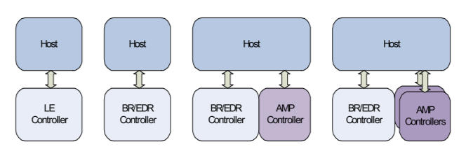

蓝牙协议是通信协议的一种，一般而言，我们把某个协议的实现代码称为协议栈（protocol stack），BLE协议栈就是实现低功耗蓝牙协议的代码。

### BLE低功耗蓝牙协议栈框架
要实现一个BLE应用，首先需要一个支持**<font style="color:#FF0000;">BLE射频的芯片</font>**，然后还需要提供一个与此芯片配套的**<font style="color:#FF0000;">BLE协议栈</font>**，最后在协议栈上**<font style="color:#FF0000;">开发自己的应用</font>**。

可以看出BLE协议栈是连接芯片和应用的桥梁，是实现整个BLE应用的关键。

简单来说，BLE协议栈主要用来对你的应用数据进行层层封包，以生成一个满足BLE协议的空中数据包，也就是说，把应用数据包裹在一系列的帧头（header）和帧尾（tail）中。

蓝牙协议规定了两个层次的协议，分别为**<font style="color:#FF0000;">蓝牙核心协议</font>**（Bluetooth Core）和**<font style="color:#FF0000;">蓝牙应用层协议</font>**（Bluetooth Application）。

蓝牙核心协议关注对蓝牙核心技术的描述和规范，它只提供基础的机制，并不关心如何使用这些机制；

蓝牙应用层协议，是在蓝牙核心协议的基础上，根据具体的应用需求，百花齐放，定义出各种各样的策略，如FTP、文件传输、局域网等等。

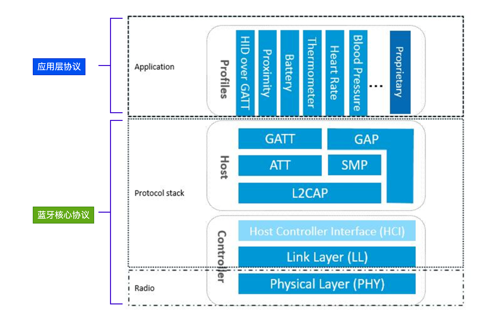

而蓝牙核心协议（Bluetooth Core）又包含BLE Controller和BLE Host两部分。Controller负责定义RF、Baseband等偏硬件的规范，并在这之上抽象出用于通信的逻辑链路（Logical Link）；Host负责在逻辑链路的基础上，进行更为友好的封装，这样就可以屏蔽掉蓝牙技术的细节，让Bluetooth Application更为方便的使用。

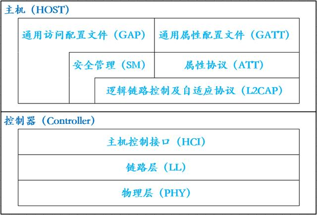

+ 物理层（Physical Layer，PHY）

PHY 层主要负责在物理信道上发送和接收信息包。Bluetooth LE 使用 40 个射频信道。频率范围：2402 MHz 到 2480 MHz。

+ 链路层（Link Layer，LL）

LL 层主要负责创建、修改和释放逻辑链路（如果有需要，还包括与之相关的逻辑传输），同时负责更新与设备之间物理链路相关的参数。它控制链路层状态机处于准备、广播、监听 / 扫描、发起连接、已连接这五种状态中的一种。

+ **主机控制接口层（Host Controller Interface，HCI）**

HCI 层向主机和控制器提供一个标准化的接口。该层可以由软件 API 实现或者使用硬件接口 UART、SPI、USB 来控制。

+ <font style="color:#DF2A3F;">通用访问配置文件层（Generic access profile，GAP）</font>

<font style="color:#DF2A3F;">GAP 层代表所有蓝牙设备通用的基本功能，例如传输、协议和应用程序配置文件使用的模式和访问程序。GAP 服务包括设备发现、连接模式、安全、身份验证、关联模型和服务发现。</font>

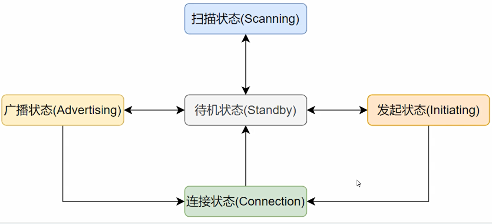

+ 逻辑链路控制及自适应协议层（Logical Link Control and Adaptation Protocol，L2CAP）

L2CAP 层负责对主机和协议栈之间交换的数据进行协议复用能力、分段和重组操作。

+ <font style="color:#DF2A3F;">安全管理层（Security Manager，SMP）</font>

<font style="color:#DF2A3F;">SMP 层用于生成加密密钥和身份密钥。SMP 还管理加密密钥和身份密钥的存储，并负责生成随机地址并将随机地址解析为已知设备身份。</font>

+ 属性协议层（Attribute protocol，ATT）

简单来说，ATT层用来定义用户命令及命令操作的数据，比如读取某个数据或者写某个数据。BLE引入了Attribute概念，用来描述一条一条的数据。Attribute除了定义数据，同时定义该数据可以使用的ATT命令，因此这一层被称为ATT层。

+ <font style="color:#DF2A3F;">通用属性配置文件层（Generic Attribute profile，GATT）</font>

<font style="color:#DF2A3F;">GATT 层是数据交换协议。定义了数据如何被组织和传输</font>

# ESP32-C3中的蓝牙功能
ESP32-C3支持Bluetooth 5（LE）。下载好固件之后（我们前面下载的固件已经支持Wi-Fi和蓝牙了），STM32仍然可以通过AT指令操作蓝牙。

## BLE角色划分
在 Bluetooth LE 协议栈中不同的层级有不同的角色划分。这些角色划分互不影响。

**<font style="color:#FF0000;">LL：</font>**设备可以划分为主机和从机，从机广播，主机可以发起连接。

GAP：定义了4种特定角色：广播者、观察者、外围设备和中心设备。

**<font style="color:#FF0000;">GATT：</font>**设备可以分为服务端和客户端。

## BLE的地址
分为公共地址和随机地址。

### 公共地址
BLE的公共地址，就类似于我们日常的身份证号码，是全球唯一的且不可改变的。

为了保证BLE公共地址的全球唯一性，其需要向IEEE购买，然后IEEE组织就会对应地分配公共地址给买家。

BLE的公共地址是全球唯一的，且在BLE设备的整个生命周期都不会改变。

总长度为6个字节，共48位。


### 随机地址
除了公共地址类型之外，还有一个随机地址类型，提供额外的隐私保护，其又分为静态地址（Static Address）和私有地址（Private Address），它们之间主要通过最高的2位有效位来区分。

静态地址。总长度也是48位，但是最高位的2位必须是0b11。随机部分至少有一个位是0和1。也 就是说不能全部是0或全部是1。设备重启之前不会改变。


私有地址。总长度也是48位。最高位是00/01。随机部分至少有一个位是0和1。也就是说不能全部是0或全部是1。设备地址每隔一段时间改变一次。


### 使用地址
**<font style="color:#FF0000;">公共地址：</font>**该类型的地址是全球唯一且固定的，理论上重复的概率基本为0，因为它们是由IEEE组织分配给买家的，适用于为保证BLE设备地址的唯一性，方便其他人辩别。

**<font style="color:#FF0000;">随机地址：</font>**说白了就是厂商白嫖，因为地址是免费的。当然也提高了隐私。随着隐私和安全性的关注增加，越来越多的蓝牙设备开始使用随机地址来减少被追踪的风险。这在蓝牙低功耗（BLE）技术中尤为常见。

## 广播
广播是指从机（服务器）每经过一个时间间隔发送一次广播数据包，这个时间间隔称为广播间隔，这个广播动作叫做广播事件，只有当从机处于广播状态时，主机（客户端）才能发现该从机（服务器）。

在每个广播事件中，广播包会分别在37、38和39三个信道上依次广播，如下图所示。

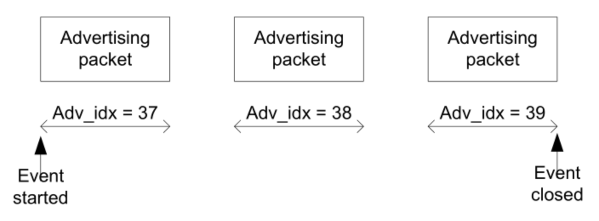

广播数据包一般包含可读的设备名称、设备是否可连接等信息。

## 扫描
扫描是主机监听从机广播数据包和发送扫描请求的过程，主机通过扫描，可以获取到从机的广播包以及扫描回应数据包，主机可以对已扫描到的从机设备发起连接请求，从而连接从机设备并通信。

## 通讯
主从之间的通信是通过GATT的Profile来完成的，Profile可以理解为配置、数据格式等。

从机作为GATT的Server端，用来定义和存储Profile。Profile包含一个或者多个Service，每个Service又包含一个或者多个Characteristic，Characteristic是主从通信的最小单元。

主机作为GATT的Client端，用来发现和获取从机的Service和Characteristic，从而与之通信。

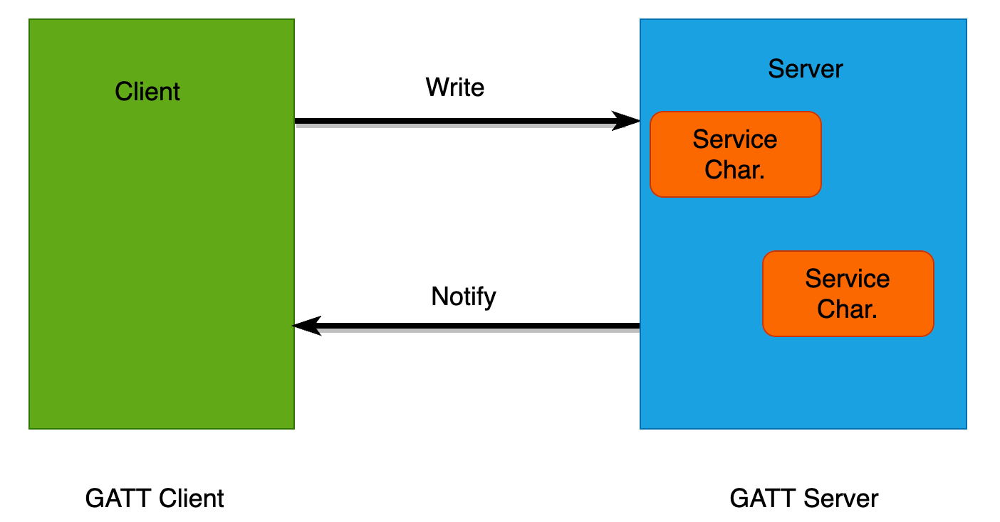

关于服务 Service和特征值Characteristic的概念。每个服务和特征值都有自己的唯一标识 UUID，标准UUID为128位，蓝牙协议栈中一般采用16位，也就是两个字节的UUID格式。

一个从机设备包括一个或者多个服务；一个服务中又可以包括一条或者多条特征值，每个特征值都有自己的属性 Property，属性的取值有：可读 Read、可写 Write、通知 Notify。


# 代码移植
## 官方示例
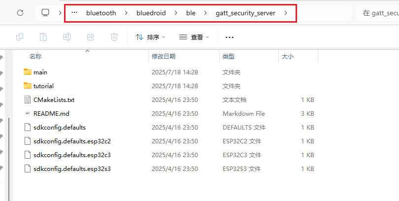


## 设置
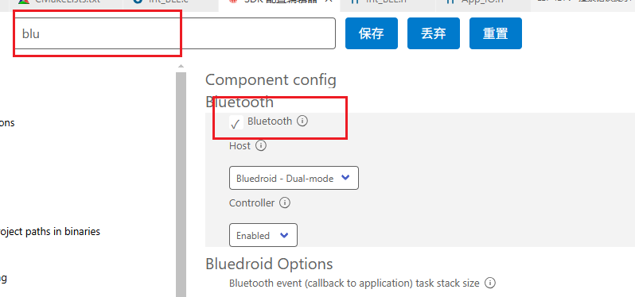

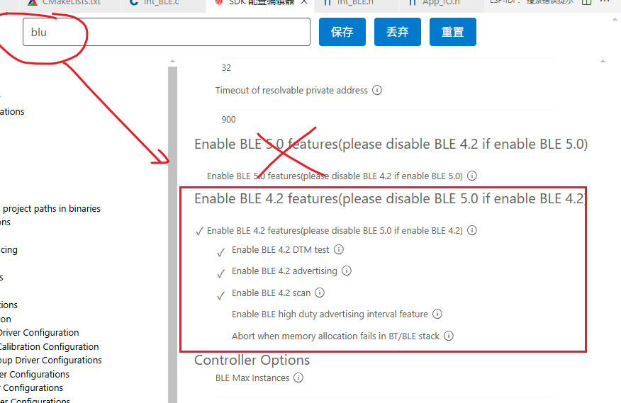

## Dri_BLE.c
```c


#include "Dri_BLE.h"

#define GATTS_TABLE_TAG "SEC_GATTS_DEMO"

#define HEART_PROFILE_NUM 1
#define HEART_PROFILE_APP_IDX 0
#define ESP_HEART_RATE_APP_ID 0x55
#define HEART_RATE_SVC_INST_ID 0

#define GATTS_DEMO_CHAR_VAL_LEN_MAX 0x40

#define ADV_CONFIG_FLAG (1 << 0)
#define SCAN_RSP_CONFIG_FLAG (1 << 1)

static char example_device_name[ESP_BLE_ADV_NAME_LEN_MAX] = "NowLetsgo";
static uint8_t adv_config_done = 0;

static uint16_t heart_rate_handle_table[HRS_IDX_NB];

static uint8_t test_manufacturer[3] = {'E', 'S', 'P'};

static uint8_t sec_service_uuid[16] = {
    /* LSB <---------- ----------------------------------------------------------------------> MSB */
    // first uuid, 16bit, [12],[13] is the value
    0xfb,
    0x34,
    0x9b,
    0x5f,
    0x80,
    0x00,
    0x00,
    0x80,
    0x00,
    0x10,
    0x00,
    0x00,
    0x18,
    0x0D,
    0x00,
    0x00,
};

// config adv data
static esp_ble_adv_data_t heart_rate_adv_config = {
    .set_scan_rsp = false,
    .include_txpower = true,
    .min_interval = 0x0006, // slave connection min interval, Time = min_interval * 1.25 msec
    .max_interval = 0x0010, // slave connection max interval, Time = max_interval * 1.25 msec
    .appearance = 0x00,
    .manufacturer_len = 0,       // TEST_MANUFACTURER_DATA_LEN,
    .p_manufacturer_data = NULL, //&test_manufacturer[0],
    .service_data_len = 0,
    .p_service_data = NULL,
    .service_uuid_len = sizeof(sec_service_uuid),
    .p_service_uuid = sec_service_uuid,
    .flag = (ESP_BLE_ADV_FLAG_GEN_DISC | ESP_BLE_ADV_FLAG_BREDR_NOT_SPT),
};
// config scan response data
static esp_ble_adv_data_t heart_rate_scan_rsp_config = {
    .set_scan_rsp = true,
    .include_name = true,
    .manufacturer_len = sizeof(test_manufacturer),
    .p_manufacturer_data = test_manufacturer,
};

static esp_ble_adv_params_t heart_rate_adv_params = {
    .adv_int_min = 0x100,
    .adv_int_max = 0x100,
    .adv_type = ADV_TYPE_IND,
    .own_addr_type = BLE_ADDR_TYPE_RPA_PUBLIC,
    .channel_map = ADV_CHNL_ALL,
    .adv_filter_policy = ADV_FILTER_ALLOW_SCAN_ANY_CON_ANY,
};

struct gatts_profile_inst
{
    esp_gatts_cb_t gatts_cb;
    uint16_t gatts_if;
    uint16_t app_id;
    uint16_t conn_id;
    uint16_t service_handle;
    esp_gatt_srvc_id_t service_id;
    uint16_t char_handle;
    esp_bt_uuid_t char_uuid;
    esp_gatt_perm_t perm;
    esp_gatt_char_prop_t property;
    uint16_t descr_handle;
    esp_bt_uuid_t descr_uuid;
};

static void gatts_profile_event_handler(esp_gatts_cb_event_t event,
                                        esp_gatt_if_t gatts_if, esp_ble_gatts_cb_param_t *param);

/* One gatt-based profile one app_id and one gatts_if, this array will store the gatts_if returned by ESP_GATTS_REG_EVT */
static struct gatts_profile_inst heart_rate_profile_tab[HEART_PROFILE_NUM] = {
    [HEART_PROFILE_APP_IDX] = {
        .gatts_cb = gatts_profile_event_handler,
        .gatts_if = ESP_GATT_IF_NONE, /* Not get the gatt_if, so initial is ESP_GATT_IF_NONE */
    },

};

/*
 *  Heart Rate PROFILE ATTRIBUTES
 ****************************************************************************************
 */

/// Heart Rate Sensor Service
static const uint16_t heart_rate_svc = ESP_GATT_UUID_HEART_RATE_SVC;

#define CHAR_DECLARATION_SIZE (sizeof(uint8_t))
static const uint16_t primary_service_uuid = ESP_GATT_UUID_PRI_SERVICE;
static const uint16_t character_declaration_uuid = ESP_GATT_UUID_CHAR_DECLARE;
static const uint16_t character_client_config_uuid = ESP_GATT_UUID_CHAR_CLIENT_CONFIG;
static const uint8_t char_prop_notify = ESP_GATT_CHAR_PROP_BIT_NOTIFY;
static const uint8_t char_prop_read = ESP_GATT_CHAR_PROP_BIT_READ;
static const uint8_t char_prop_read_write = ESP_GATT_CHAR_PROP_BIT_WRITE | ESP_GATT_CHAR_PROP_BIT_READ;

/// Heart Rate Sensor Service - Heart Rate Measurement Characteristic, notify
static const uint16_t heart_rate_meas_uuid = ESP_GATT_HEART_RATE_MEAS;
static const uint8_t heart_measurement_ccc[2] = {0x00, 0x00};

/// Heart Rate Sensor Service -Body Sensor Location characteristic, read
static const uint16_t body_sensor_location_uuid = ESP_GATT_BODY_SENSOR_LOCATION;
static const uint8_t body_sensor_loc_val[1] = {0x00};

/// Heart Rate Sensor Service - Heart Rate Control Point characteristic, write&read
static const uint16_t heart_rate_ctrl_point = ESP_GATT_HEART_RATE_CNTL_POINT;
static const uint8_t heart_ctrl_point[1] = {0x00};

/// Full HRS Database Description - Used to add attributes into the database
static const esp_gatts_attr_db_t heart_rate_gatt_db[HRS_IDX_NB] =
    {
        // Heart Rate Service Declaration
        [HRS_IDX_SVC] =
            {{ESP_GATT_AUTO_RSP}, {ESP_UUID_LEN_16, (uint8_t *)&primary_service_uuid, ESP_GATT_PERM_READ, sizeof(uint16_t), sizeof(heart_rate_svc), (uint8_t *)&heart_rate_svc}},

        // Heart Rate Measurement Characteristic Declaration
        [HRS_IDX_HR_MEAS_CHAR] =
            {{ESP_GATT_AUTO_RSP}, {ESP_UUID_LEN_16, (uint8_t *)&character_declaration_uuid, ESP_GATT_PERM_READ, CHAR_DECLARATION_SIZE, CHAR_DECLARATION_SIZE, (uint8_t *)&char_prop_notify}},

        // Heart Rate Measurement Characteristic Value
        [HRS_IDX_HR_MEAS_VAL] =
            {{ESP_GATT_AUTO_RSP}, {ESP_UUID_LEN_16, (uint8_t *)&heart_rate_meas_uuid, ESP_GATT_PERM_READ, HRPS_HT_MEAS_MAX_LEN, 0, NULL}},

        // Heart Rate Measurement Characteristic - Client Characteristic Configuration Descriptor
        [HRS_IDX_HR_MEAS_NTF_CFG] =
            {{ESP_GATT_AUTO_RSP}, {ESP_UUID_LEN_16, (uint8_t *)&character_client_config_uuid, ESP_GATT_PERM_READ | ESP_GATT_PERM_WRITE, sizeof(uint16_t), sizeof(heart_measurement_ccc), (uint8_t *)heart_measurement_ccc}},

        // Body Sensor Location Characteristic Declaration
        [HRS_IDX_BOBY_SENSOR_LOC_CHAR] =
            {{ESP_GATT_AUTO_RSP}, {ESP_UUID_LEN_16, (uint8_t *)&character_declaration_uuid, ESP_GATT_PERM_READ, CHAR_DECLARATION_SIZE, CHAR_DECLARATION_SIZE, (uint8_t *)&char_prop_read}},

        // Body Sensor Location Characteristic Value
        [HRS_IDX_BOBY_SENSOR_LOC_VAL] =
            {{ESP_GATT_AUTO_RSP}, {ESP_UUID_LEN_16, (uint8_t *)&body_sensor_location_uuid, ESP_GATT_PERM_READ_ENCRYPTED, sizeof(uint8_t), sizeof(body_sensor_loc_val), (uint8_t *)body_sensor_loc_val}},

        // Heart Rate Control Point Characteristic Declaration
        [HRS_IDX_HR_CTNL_PT_CHAR] =
            {{ESP_GATT_AUTO_RSP}, {ESP_UUID_LEN_16, (uint8_t *)&character_declaration_uuid, ESP_GATT_PERM_READ, CHAR_DECLARATION_SIZE, CHAR_DECLARATION_SIZE, (uint8_t *)&char_prop_read_write}},

        // Heart Rate Control Point Characteristic Value
        [HRS_IDX_HR_CTNL_PT_VAL] =
            {{ESP_GATT_AUTO_RSP}, {ESP_UUID_LEN_16, (uint8_t *)&heart_rate_ctrl_point, ESP_GATT_PERM_WRITE_ENCRYPTED | ESP_GATT_PERM_READ_ENCRYPTED, sizeof(uint8_t), sizeof(heart_ctrl_point), (uint8_t *)heart_ctrl_point}},
};

static char *esp_key_type_to_str(esp_ble_key_type_t key_type)
{
    char *key_str = NULL;
    switch (key_type)
    {
    case ESP_LE_KEY_NONE:
        key_str = "ESP_LE_KEY_NONE";
        break;
    case ESP_LE_KEY_PENC:
        key_str = "ESP_LE_KEY_PENC";
        break;
    case ESP_LE_KEY_PID:
        key_str = "ESP_LE_KEY_PID";
        break;
    case ESP_LE_KEY_PCSRK:
        key_str = "ESP_LE_KEY_PCSRK";
        break;
    case ESP_LE_KEY_PLK:
        key_str = "ESP_LE_KEY_PLK";
        break;
    case ESP_LE_KEY_LLK:
        key_str = "ESP_LE_KEY_LLK";
        break;
    case ESP_LE_KEY_LENC:
        key_str = "ESP_LE_KEY_LENC";
        break;
    case ESP_LE_KEY_LID:
        key_str = "ESP_LE_KEY_LID";
        break;
    case ESP_LE_KEY_LCSRK:
        key_str = "ESP_LE_KEY_LCSRK";
        break;
    default:
        key_str = "INVALID BLE KEY TYPE";
        break;
    }

    return key_str;
}

static char *esp_auth_req_to_str(esp_ble_auth_req_t auth_req)
{
    char *auth_str = NULL;
    switch (auth_req)
    {
    case ESP_LE_AUTH_NO_BOND:
        auth_str = "ESP_LE_AUTH_NO_BOND";
        break;
    case ESP_LE_AUTH_BOND:
        auth_str = "ESP_LE_AUTH_BOND";
        break;
    case ESP_LE_AUTH_REQ_MITM:
        auth_str = "ESP_LE_AUTH_REQ_MITM";
        break;
    case ESP_LE_AUTH_REQ_BOND_MITM:
        auth_str = "ESP_LE_AUTH_REQ_BOND_MITM";
        break;
    case ESP_LE_AUTH_REQ_SC_ONLY:
        auth_str = "ESP_LE_AUTH_REQ_SC_ONLY";
        break;
    case ESP_LE_AUTH_REQ_SC_BOND:
        auth_str = "ESP_LE_AUTH_REQ_SC_BOND";
        break;
    case ESP_LE_AUTH_REQ_SC_MITM:
        auth_str = "ESP_LE_AUTH_REQ_SC_MITM";
        break;
    case ESP_LE_AUTH_REQ_SC_MITM_BOND:
        auth_str = "ESP_LE_AUTH_REQ_SC_MITM_BOND";
        break;
    default:
        auth_str = "INVALID BLE AUTH REQ";
        break;
    }

    return auth_str;
}

static void show_bonded_devices(void)
{
    int dev_num = esp_ble_get_bond_device_num();
    if (dev_num == 0)
    {
        ESP_LOGI(GATTS_TABLE_TAG, "Bonded devices number zero\n");
        return;
    }

    esp_ble_bond_dev_t *dev_list = (esp_ble_bond_dev_t *)malloc(sizeof(esp_ble_bond_dev_t) * dev_num);
    if (!dev_list)
    {
        ESP_LOGI(GATTS_TABLE_TAG, "malloc failed, return\n");
        return;
    }
    esp_ble_get_bond_device_list(&dev_num, dev_list);
    ESP_LOGI(GATTS_TABLE_TAG, "Bonded devices number %d", dev_num);
    for (int i = 0; i < dev_num; i++)
    {
        ESP_LOGI(GATTS_TABLE_TAG, "[%u] addr_type %u, addr " ESP_BD_ADDR_STR "",
                 i, dev_list[i].bd_addr_type, ESP_BD_ADDR_HEX(dev_list[i].bd_addr));
    }

    free(dev_list);
}

static void __attribute__((unused)) remove_all_bonded_devices(void)
{
    int dev_num = esp_ble_get_bond_device_num();
    if (dev_num == 0)
    {
        ESP_LOGI(GATTS_TABLE_TAG, "Bonded devices number zero\n");
        return;
    }

    esp_ble_bond_dev_t *dev_list = (esp_ble_bond_dev_t *)malloc(sizeof(esp_ble_bond_dev_t) * dev_num);
    if (!dev_list)
    {
        ESP_LOGI(GATTS_TABLE_TAG, "malloc failed, return\n");
        return;
    }
    esp_ble_get_bond_device_list(&dev_num, dev_list);
    for (int i = 0; i < dev_num; i++)
    {
        esp_ble_remove_bond_device(dev_list[i].bd_addr);
    }

    free(dev_list);
}

static void gap_event_handler(esp_gap_ble_cb_event_t event, esp_ble_gap_cb_param_t *param)
{
    ESP_LOGV(GATTS_TABLE_TAG, "GAP_EVT, event %d", event);

    switch (event)
    {
    case ESP_GAP_BLE_SCAN_RSP_DATA_SET_COMPLETE_EVT:
        adv_config_done &= (~SCAN_RSP_CONFIG_FLAG);
        if (adv_config_done == 0)
        {
            esp_ble_gap_start_advertising(&heart_rate_adv_params);
        }
        break;
    case ESP_GAP_BLE_ADV_DATA_SET_COMPLETE_EVT:
        adv_config_done &= (~ADV_CONFIG_FLAG);
        if (adv_config_done == 0)
        {
            esp_ble_gap_start_advertising(&heart_rate_adv_params);
        }
        break;
    case ESP_GAP_BLE_ADV_START_COMPLETE_EVT:
        // advertising start complete event to indicate advertising start successfully or failed
        if (param->adv_start_cmpl.status != ESP_BT_STATUS_SUCCESS)
        {
            ESP_LOGE(GATTS_TABLE_TAG, "Advertising start failed, status %x", param->adv_start_cmpl.status);
            break;
        }
        ESP_LOGI(GATTS_TABLE_TAG, "Advertising start successfully");
        break;
    case ESP_GAP_BLE_PASSKEY_REQ_EVT: /* passkey request event */
        ESP_LOGI(GATTS_TABLE_TAG, "Passkey request");
        /* Call the following function to input the passkey which is displayed on the remote device */
        // esp_ble_passkey_reply(heart_rate_profile_tab[HEART_PROFILE_APP_IDX].remote_bda, true, 0x00);
        break;
    case ESP_GAP_BLE_OOB_REQ_EVT:
    {
        ESP_LOGI(GATTS_TABLE_TAG, "OOB request");
        uint8_t tk[16] = {1}; // If you paired with OOB, both devices need to use the same tk
        esp_ble_oob_req_reply(param->ble_security.ble_req.bd_addr, tk, sizeof(tk));
        break;
    }
    case ESP_GAP_BLE_LOCAL_IR_EVT: /* BLE local IR event */
        ESP_LOGI(GATTS_TABLE_TAG, "Local identity root");
        break;
    case ESP_GAP_BLE_LOCAL_ER_EVT: /* BLE local ER event */
        ESP_LOGI(GATTS_TABLE_TAG, "Local encryption root");
        break;
    case ESP_GAP_BLE_NC_REQ_EVT:
        /* The app will receive this evt when the IO has DisplayYesNO capability and the peer device IO also has DisplayYesNo capability.
        show the passkey number to the user to confirm it with the number displayed by peer device. */
        esp_ble_confirm_reply(param->ble_security.ble_req.bd_addr, true);
        ESP_LOGI(GATTS_TABLE_TAG, "Numeric Comparison request, passkey %" PRIu32, param->ble_security.key_notif.passkey);
        break;
    case ESP_GAP_BLE_SEC_REQ_EVT:
        /* send the positive(true) security response to the peer device to accept the security request.
        If not accept the security request, should send the security response with negative(false) accept value*/
        esp_ble_gap_security_rsp(param->ble_security.ble_req.bd_addr, true);
        break;
    case ESP_GAP_BLE_PASSKEY_NOTIF_EVT: /// the app will receive this evt when the IO  has Output capability and the peer device IO has Input capability.
        /// show the passkey number to the user to input it in the peer device.
        ESP_LOGI(GATTS_TABLE_TAG, "Passkey notify, passkey %06" PRIu32, param->ble_security.key_notif.passkey);
        break;
    case ESP_GAP_BLE_KEY_EVT:
        // shows the ble key info share with peer device to the user.
        ESP_LOGI(GATTS_TABLE_TAG, "Key exchanged, key_type %s", esp_key_type_to_str(param->ble_security.ble_key.key_type));
        break;
    case ESP_GAP_BLE_AUTH_CMPL_EVT:
    {
        esp_bd_addr_t bd_addr;
        memcpy(bd_addr, param->ble_security.auth_cmpl.bd_addr, sizeof(esp_bd_addr_t));
        ESP_LOGI(GATTS_TABLE_TAG, "Authentication complete, addr_type %u, addr " ESP_BD_ADDR_STR "",
                 param->ble_security.auth_cmpl.addr_type, ESP_BD_ADDR_HEX(bd_addr));
        if (!param->ble_security.auth_cmpl.success)
        {
            ESP_LOGI(GATTS_TABLE_TAG, "Pairing failed, reason 0x%x", param->ble_security.auth_cmpl.fail_reason);
        }
        else
        {
            ESP_LOGI(GATTS_TABLE_TAG, "Pairing successfully, auth_mode %s", esp_auth_req_to_str(param->ble_security.auth_cmpl.auth_mode));
        }
        show_bonded_devices();
        break;
    }
    case ESP_GAP_BLE_REMOVE_BOND_DEV_COMPLETE_EVT:
    {
        ESP_LOGD(GATTS_TABLE_TAG, "Bond device remove, status %d, device " ESP_BD_ADDR_STR "",
                 param->remove_bond_dev_cmpl.status, ESP_BD_ADDR_HEX(param->remove_bond_dev_cmpl.bd_addr));
        break;
    }
    case ESP_GAP_BLE_SET_LOCAL_PRIVACY_COMPLETE_EVT:
        if (param->local_privacy_cmpl.status != ESP_BT_STATUS_SUCCESS)
        {
            ESP_LOGE(GATTS_TABLE_TAG, "Local privacy config failed, status %x", param->local_privacy_cmpl.status);
            break;
        }
        ESP_LOGI(GATTS_TABLE_TAG, "Local privacy config successfully");

        esp_err_t ret = esp_ble_gap_config_adv_data(&heart_rate_adv_config);
        if (ret)
        {
            ESP_LOGE(GATTS_TABLE_TAG, "config adv data failed, error code = %x", ret);
        }
        else
        {
            adv_config_done |= ADV_CONFIG_FLAG;
        }

        ret = esp_ble_gap_config_adv_data(&heart_rate_scan_rsp_config);
        if (ret)
        {
            ESP_LOGE(GATTS_TABLE_TAG, "config adv data failed, error code = %x", ret);
        }
        else
        {
            adv_config_done |= SCAN_RSP_CONFIG_FLAG;
        }

        break;
    default:
        break;
    }
}

static void gatts_profile_event_handler(esp_gatts_cb_event_t event,
                                        esp_gatt_if_t gatts_if, esp_ble_gatts_cb_param_t *param)
{
    ESP_LOGV(GATTS_TABLE_TAG, "event = %x", event);
    switch (event)
    {
    case ESP_GATTS_REG_EVT:
        ESP_LOGI(GATTS_TABLE_TAG, "GATT server register, status %d, app_id %d, gatts_if %d",
                 param->reg.status, param->reg.app_id, gatts_if);
        esp_ble_gap_set_device_name(example_device_name);
        // generate a resolvable random address
        esp_ble_gap_config_local_privacy(true);
        esp_ble_gatts_create_attr_tab(heart_rate_gatt_db, gatts_if,
                                      HRS_IDX_NB, HEART_RATE_SVC_INST_ID);
        break;
    case ESP_GATTS_READ_EVT:
        break;
    case ESP_GATTS_WRITE_EVT:
        ESP_LOGI(GATTS_TABLE_TAG, "Characteristic write, value ");
        ESP_LOG_BUFFER_HEX(GATTS_TABLE_TAG, param->write.value, param->write.len);
        MY_LOGI("Value = %s,Len = %d", param->write.value, param->write.len);
        break;
    case ESP_GATTS_EXEC_WRITE_EVT:
        break;
    case ESP_GATTS_MTU_EVT:
        break;
    case ESP_GATTS_CONF_EVT:
        break;
    case ESP_GATTS_UNREG_EVT:
        break;
    case ESP_GATTS_DELETE_EVT:
        break;
    case ESP_GATTS_START_EVT:
        break;
    case ESP_GATTS_STOP_EVT:
        break;
    case ESP_GATTS_CONNECT_EVT:
        ESP_LOGI(GATTS_TABLE_TAG, "Connected, conn_id %u, remote " ESP_BD_ADDR_STR "",
                 param->connect.conn_id, ESP_BD_ADDR_HEX(param->connect.remote_bda));
        /* start security connect with peer device when receive the connect event sent by the master */
        esp_ble_set_encryption(param->connect.remote_bda, ESP_BLE_SEC_ENCRYPT_MITM);
        break;
    case ESP_GATTS_DISCONNECT_EVT:
        ESP_LOGI(GATTS_TABLE_TAG, "Disconnected, remote " ESP_BD_ADDR_STR ", reason 0x%x",
                 ESP_BD_ADDR_HEX(param->disconnect.remote_bda), param->disconnect.reason);
        /* start advertising again when missing the connect */
        esp_ble_gap_start_advertising(&heart_rate_adv_params);
        break;
    case ESP_GATTS_OPEN_EVT:
        break;
    case ESP_GATTS_CANCEL_OPEN_EVT:
        break;
    case ESP_GATTS_CLOSE_EVT:
        break;
    case ESP_GATTS_LISTEN_EVT:
        break;
    case ESP_GATTS_CONGEST_EVT:
        break;
    case ESP_GATTS_CREAT_ATTR_TAB_EVT:
    {
        if (param->create.status == ESP_GATT_OK)
        {
            if (param->add_attr_tab.num_handle == HRS_IDX_NB)
            {
                ESP_LOGI(GATTS_TABLE_TAG, "Attribute table create successfully, num_handle %x", param->add_attr_tab.num_handle);
                memcpy(heart_rate_handle_table, param->add_attr_tab.handles,
                       sizeof(heart_rate_handle_table));
                esp_ble_gatts_start_service(heart_rate_handle_table[HRS_IDX_SVC]);
            }
            else
            {
                ESP_LOGE(GATTS_TABLE_TAG, "Attribute table create abnormally, num_handle (%d) doesn't equal to HRS_IDX_NB(%d)",
                         param->add_attr_tab.num_handle, HRS_IDX_NB);
            }
        }
        else
        {
            ESP_LOGE(GATTS_TABLE_TAG, "Attribute table create failed, error code = %x", param->create.status);
        }
        break;
    }

    default:
        break;
    }
}

static void gatts_event_handler(esp_gatts_cb_event_t event, esp_gatt_if_t gatts_if,
                                esp_ble_gatts_cb_param_t *param)
{
    /* If event is register event, store the gatts_if for each profile */
    if (event == ESP_GATTS_REG_EVT)
    {
        if (param->reg.status == ESP_GATT_OK)
        {
            heart_rate_profile_tab[HEART_PROFILE_APP_IDX].gatts_if = gatts_if;
        }
        else
        {
            ESP_LOGI(GATTS_TABLE_TAG, "Reg app failed, app_id %04x, status %d",
                     param->reg.app_id,
                     param->reg.status);
            return;
        }
    }

    do
    {
        int idx;
        for (idx = 0; idx < HEART_PROFILE_NUM; idx++)
        {
            if (gatts_if == ESP_GATT_IF_NONE || /* ESP_GATT_IF_NONE, not specify a certain gatt_if, need to call every profile cb function */
                gatts_if == heart_rate_profile_tab[idx].gatts_if)
            {
                if (heart_rate_profile_tab[idx].gatts_cb)
                {
                    heart_rate_profile_tab[idx].gatts_cb(event, gatts_if, param);
                }
            }
        }
    } while (0);
}

void Dri_BLE_Init(void)
{
    esp_err_t ret;

    // 1. 初始化NVS,为了存储已经连接过的设备信息
    ret = nvs_flash_init();
    if (ret == ESP_ERR_NVS_NO_FREE_PAGES || ret == ESP_ERR_NVS_NEW_VERSION_FOUND)
    {
        ESP_ERROR_CHECK(nvs_flash_erase());
        ret = nvs_flash_init();
    }
    ESP_ERROR_CHECK(ret);

#if CONFIG_EXAMPLE_CI_PIPELINE_ID
    memcpy(example_device_name, esp_bluedroid_get_example_name(), ESP_BLE_ADV_NAME_LEN_MAX);
#endif

    // 2. 不管之前是否部署过经典蓝牙,释放一次内存
    ESP_ERROR_CHECK(esp_bt_controller_mem_release(ESP_BT_MODE_CLASSIC_BT));

    // 3. 初始化蓝牙模块
    esp_bt_controller_config_t bt_cfg = BT_CONTROLLER_INIT_CONFIG_DEFAULT();
    ret = esp_bt_controller_init(&bt_cfg);
    if (ret)
    {
        ESP_LOGE(GATTS_TABLE_TAG, "%s init controller failed: %s", __func__, esp_err_to_name(ret));
        return;
    }
    ret = esp_bt_controller_enable(ESP_BT_MODE_BLE);
    if (ret)
    {
        ESP_LOGE(GATTS_TABLE_TAG, "%s enable controller failed: %s", __func__, esp_err_to_name(ret));
        return;
    }

    // 4. 初始化蓝牙应用层软件模块
    ESP_LOGI(GATTS_TABLE_TAG, "%s init bluetooth", __func__);

    ret = esp_bluedroid_init();
    if (ret)
    {
        ESP_LOGE(GATTS_TABLE_TAG, "%s init bluetooth failed: %s", __func__, esp_err_to_name(ret));
        return;
    }
    ret = esp_bluedroid_enable();
    if (ret)
    {
        ESP_LOGE(GATTS_TABLE_TAG, "%s enable bluetooth failed: %s", __func__, esp_err_to_name(ret));
        return;
    }

    // 5. 注册回调函数
    ret = esp_ble_gatts_register_callback(gatts_event_handler);
    if (ret)
    {
        ESP_LOGE(GATTS_TABLE_TAG, "gatts register error, error code = %x", ret);
        return;
    }
    ret = esp_ble_gap_register_callback(gap_event_handler);
    if (ret)
    {
        ESP_LOGE(GATTS_TABLE_TAG, "gap register error, error code = %x", ret);
        return;
    }
    ret = esp_ble_gatts_app_register(ESP_HEART_RATE_APP_ID);
    if (ret)
    {
        ESP_LOGE(GATTS_TABLE_TAG, "gatts app register error, error code = %x", ret);
        return;
    }

    // 6. 设置安全参数,未来传输数据加密时 采用非对称加密
    /* set the security iocap & auth_req & key size & init key response key parameters to the stack*/
    esp_ble_auth_req_t auth_req = ESP_LE_AUTH_REQ_SC_MITM_BOND; // bonding with peer device after authentication
    esp_ble_io_cap_t iocap = ESP_IO_CAP_NONE;                   // set the IO capability to No output No input
    uint8_t key_size = 16;                                      // the key size should be 7~16 bytes
    uint8_t init_key = ESP_BLE_ENC_KEY_MASK | ESP_BLE_ID_KEY_MASK;
    uint8_t rsp_key = ESP_BLE_ENC_KEY_MASK | ESP_BLE_ID_KEY_MASK;
    // set static passkey
    uint32_t passkey = 123456;
    uint8_t auth_option = ESP_BLE_ONLY_ACCEPT_SPECIFIED_AUTH_DISABLE;
    uint8_t oob_support = ESP_BLE_OOB_DISABLE;
    esp_ble_gap_set_security_param(ESP_BLE_SM_SET_STATIC_PASSKEY, &passkey, sizeof(uint32_t));
    esp_ble_gap_set_security_param(ESP_BLE_SM_AUTHEN_REQ_MODE, &auth_req, sizeof(uint8_t));
    esp_ble_gap_set_security_param(ESP_BLE_SM_IOCAP_MODE, &iocap, sizeof(uint8_t));
    esp_ble_gap_set_security_param(ESP_BLE_SM_MAX_KEY_SIZE, &key_size, sizeof(uint8_t));
    esp_ble_gap_set_security_param(ESP_BLE_SM_ONLY_ACCEPT_SPECIFIED_SEC_AUTH, &auth_option, sizeof(uint8_t));
    esp_ble_gap_set_security_param(ESP_BLE_SM_OOB_SUPPORT, &oob_support, sizeof(uint8_t));
    /* If your BLE device acts as a Slave, the init_key means you hope which types of key of the master should distribute to you,
    and the response key means which key you can distribute to the master;
    If your BLE device acts as a master, the response key means you hope which types of key of the slave should distribute to you,
    and the init key means which key you can distribute to the slave. */
    esp_ble_gap_set_security_param(ESP_BLE_SM_SET_INIT_KEY, &init_key, sizeof(uint8_t));
    esp_ble_gap_set_security_param(ESP_BLE_SM_SET_RSP_KEY, &rsp_key, sizeof(uint8_t));

    /* Just show how to clear all the bonded devices
     * Delay 30s, clear all the bonded devices
     *
     * vTaskDelay(30000 / portTICK_PERIOD_MS);
     * remove_all_bonded_devices();
     */
}

```


## Dri_BLE.h
```c
#ifndef __INT_BLE_H__
#define __INT_BLE_H__

#include <stdio.h>
#include <stdlib.h>
#include <string.h>
#include <inttypes.h>
#include "freertos/FreeRTOS.h"
#include "freertos/task.h"
#include "freertos/event_groups.h"
#include "esp_system.h"
#include "esp_log.h"
#include "nvs_flash.h"
#include "esp_bt.h"

#include "esp_gap_ble_api.h"
#include "esp_gatts_api.h"
#include "esp_bt_defs.h"
#include "esp_bt_main.h"
#include "esp_bt_device.h"

#include "Com/Com_Debug.h"

/*
 * DEFINES
 ****************************************************************************************
 */

#define HRPS_HT_MEAS_MAX_LEN (13)

#define HRPS_MANDATORY_MASK (0x0F)
#define HRPS_BODY_SENSOR_LOC_MASK (0x30)
#define HRPS_HR_CTNL_PT_MASK (0xC0)

/// Attributes State Machine
enum
{
    HRS_IDX_SVC,

    HRS_IDX_HR_MEAS_CHAR,
    HRS_IDX_HR_MEAS_VAL,
    HRS_IDX_HR_MEAS_NTF_CFG,

    HRS_IDX_BOBY_SENSOR_LOC_CHAR,
    HRS_IDX_BOBY_SENSOR_LOC_VAL,

    HRS_IDX_HR_CTNL_PT_CHAR,
    HRS_IDX_HR_CTNL_PT_VAL,

    HRS_IDX_NB,
};

void Dri_BLE_Init(void);

#endif /* __INT_BLE_H__ */

```

## main.c
```c
// 初始化
Dri_BLE_Init();
```

# 弱函数实现
## Dri_BLE.c
```c
/**
 * @brief 定义esp32收到手机数据时的回调弱函数
 */
void __attribute__((weak)) App_Communication_ReceDataCb(uint8_t *data, uint16_t datalen)
{
}


//在gatts_profile_event_handler中调用该函数,并传入收到数据和长度
```

## App_Communication.h
```c
#ifndef __APP_COMMUNICATION_H__
#define __APP_COMMUNICATION_H__

#include "Int/Int_BLE.h"

/**
 * @brief 初始化
 */
void App_Communication_Init(void);

#endif /* __APP_COMMUNICATION_H__ */

```

## App_Communication.c
```c
#include "App_Communication.h"

/**
 * @brief 初始化
 */
void App_Communication_Init(void)
{
    Dri_BLE_Init();
}

/**
 * @brief 弱函数的实现
 */
void App_Communication_ReceDataCb(uint8_t *data, uint16_t datalen)
{
    MY_LOGI("value = %s,len = %d", data, datalen);
}
```

# 功能实现
```c
/**
 * @brief 弱函数的实现
 */
void App_Communication_ReceDataCb(uint8_t *data, uint16_t datalen)
{
    MY_LOGI("value = %s,len = %d", data, datalen);

    // 数据格式:0+12345 1+12345
    uint8_t flag = data[0];
    uint8_t pwd[100] = {0};
    memcpy(pwd, &data[2], datalen - 2);

    Com_Status com_status;
    // 根据flag做下一步操作
    switch (flag)
    {
    case '0':
        com_status = Dri_NVS_WriteStr((char *)pwd, "0");
        if (com_status != Com_OK)
        {
            sayWithoutInt();
            sayAddFail();
            return;
        }
        sayWithoutInt();
        sayAddSucc();
        break;
    case '1':
        com_status = Dri_NVS_Delete((char *)pwd);
        if (com_status != Com_OK)
        {
            sayWithoutInt();
            sayDelFail();
            return;
        }
        sayWithoutInt();
        sayDelSucc();
        break;
    case '2':
        com_status = Dri_NVS_FindKey((char *)pwd);
        if (com_status != Com_OK)
        {
            sayWithoutInt();
            sayVerifyFail();
            sayWithoutInt();
            sayRetry();
            return;
        }
        sayWithoutInt();
        sayVerifySucc();
        sayWithoutInt();
        sayDoorOpen();
        Int_BDR6120_OpenLock();
        break;
    }
}
```


