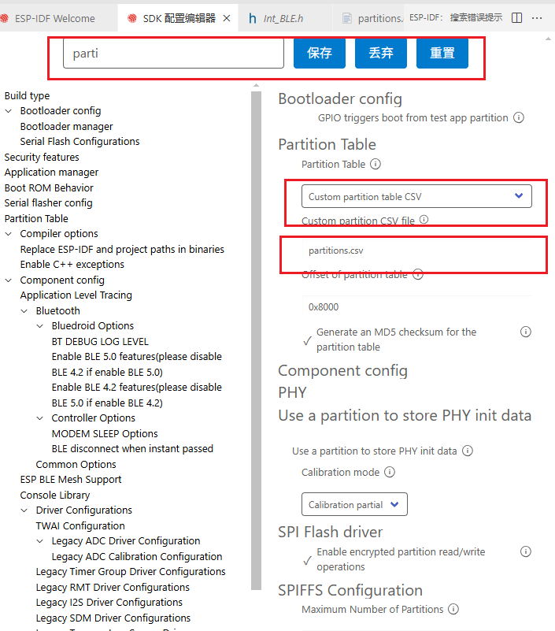
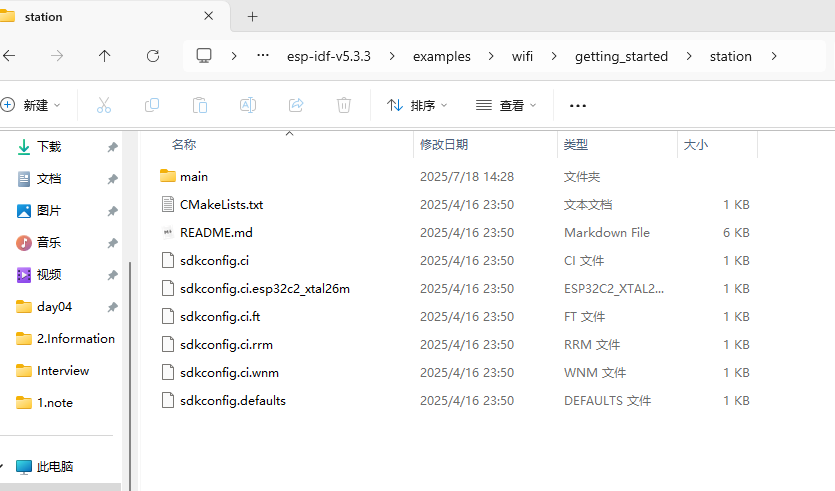
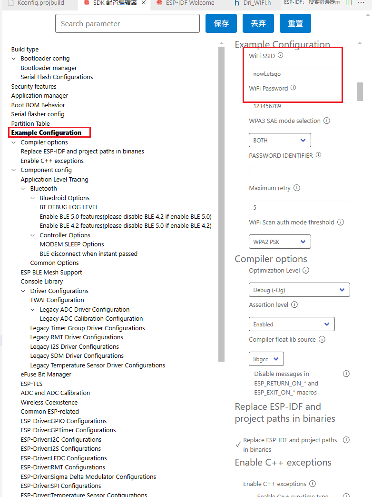
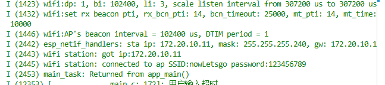
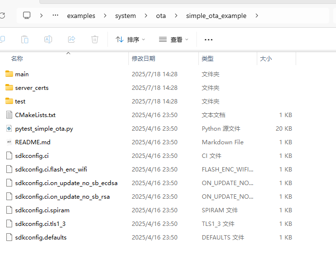
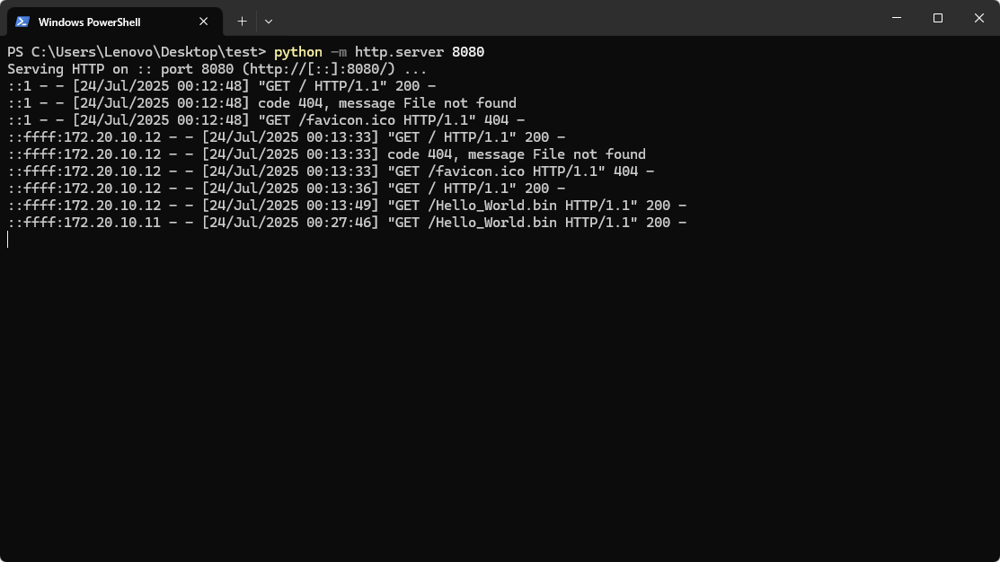

# OTA功能

<font style="color:rgb(44, 44, 54);">OTA（Over-The-Air）升级机制是一种通过无线方式对设备的固件进行远程更新的技术，广泛应用于物联网（IoT）、智能家居、可穿戴设备等领域。它可以在不拆机、不插线的情况下完成设备固件更新，提升用户体验和维护效率。</font>

# <font style="color:rgb(44, 44, 54);">OTA升级流程</font>
## <font style="color:rgb(44, 44, 54);">分区表配置</font>
<font style="color:rgb(44, 44, 54);">OTA 升级依赖于设备的</font>**<font style="color:rgb(44, 44, 54);">分区表结构</font>**<font style="color:rgb(44, 44, 54);">。通常，分区表至少包含以下几类分区：</font>

| **<font style="color:rgb(44, 44, 54);">分区名称</font>**     | **<font style="color:rgb(44, 44, 54);">作用说明</font>**     |
| ------------------------------------------------------------ | ------------------------------------------------------------ |
| `ota_0` | <font style="color:rgb(44, 44, 54);">用于存储当前运行或下载的固件镜像</font> |
| `ota_1` | <font style="color:rgb(44, 44, 54);">用于存储当前运行或下载的固件镜像</font> |
| `ota_data` | <font style="color:rgb(44, 44, 54);">存储当前启动使用的是哪个 OTA 分区（例如 ota_0 或 ota_1）</font> |

**OTA** 升级时，新固件写入当前未运行的分区（如当前运行在 **ota_0**，则升级写入 **ota_1**。更新完成后，修改**ota_data** 分区的标志，使系统下次启动时从新分区启动。


## <font style="color:rgb(44, 44, 54);">OTA 升级流程详解</font>
#### <font style="color:rgb(44, 44, 54);">1. </font>**<font style="color:rgb(44, 44, 54);">设备连接网络</font>**
<font style="color:rgb(44, 44, 54);">设备通过 Wi-Fi、蓝牙、以太网或蜂窝网络等方式连接到互联网，准备接收固件更新包。</font>

#### <font style="color:rgb(44, 44, 54);">2. </font>**<font style="color:rgb(44, 44, 54);">检查是否有新版本固件</font>**
+ <font style="color:rgb(44, 44, 54);">设备向服务器发送请求，获取当前固件版本信息。</font>
+ <font style="color:rgb(44, 44, 54);">若服务器有更高版本的固件，则触发 OTA 升级。</font>

#### <font style="color:rgb(44, 44, 54);">3. </font>**<font style="color:rgb(44, 44, 54);">下载新固件到备用分区</font>**
+ <font style="color:rgb(44, 44, 54);">固件更新包通过网络传输到设备。</font>
+ <font style="color:rgb(44, 44, 54);">固件被写入当前</font>**<font style="color:rgb(44, 44, 54);">未运行的 OTA 分区</font>**<font style="color:rgb(44, 44, 54);">（如当前运行在</font><font style="color:rgb(44, 44, 54);"> </font>`<font style="color:rgb(44, 44, 54);background-color:rgba(175, 184, 193, 0.2);">ota_0</font>`<font style="color:rgb(44, 44, 54);">，则写入</font><font style="color:rgb(44, 44, 54);"> </font>`<font style="color:rgb(44, 44, 54);background-color:rgba(175, 184, 193, 0.2);">ota_1</font>`<font style="color:rgb(44, 44, 54);">）。</font>
+ <font style="color:rgb(44, 44, 54);">在写入过程中，通常会对数据进行</font>**<font style="color:rgb(44, 44, 54);">校验</font>**<font style="color:rgb(44, 44, 54);">，确保完整性。</font>

#### <font style="color:rgb(44, 44, 54);">4. </font>**<font style="color:rgb(44, 44, 54);">验证新固件</font>**
+ <font style="color:rgb(44, 44, 54);">固件写入完成后，系统会对新固件进行验证，例如：</font>
    - <font style="color:rgb(44, 44, 54);">校验 CRC 或 SHA256 哈希值</font>
    - <font style="color:rgb(44, 44, 54);">检查固件签名（用于防篡改）</font>
+ <font style="color:rgb(44, 44, 54);">如果验证失败，可能丢弃更新或回滚到旧版本。</font>

#### <font style="color:rgb(44, 44, 54);">5. </font>**<font style="color:rgb(44, 44, 54);">更新 OTA 数据分区</font>**
+ <font style="color:rgb(44, 44, 54);">如果验证成功，系统会更新</font><font style="color:rgb(44, 44, 54);"> </font>`<font style="color:rgb(44, 44, 54);background-color:rgba(175, 184, 193, 0.2);">ota_data</font>`<font style="color:rgb(44, 44, 54);"> </font><font style="color:rgb(44, 44, 54);">分区的内容，标记下一次启动使用的固件分区（如从</font><font style="color:rgb(44, 44, 54);"> </font>`<font style="color:rgb(44, 44, 54);background-color:rgba(175, 184, 193, 0.2);">ota_0</font>`<font style="color:rgb(44, 44, 54);"> </font><font style="color:rgb(44, 44, 54);">改为</font><font style="color:rgb(44, 44, 54);"> </font>`<font style="color:rgb(44, 44, 54);background-color:rgba(175, 184, 193, 0.2);">ota_1</font>`<font style="color:rgb(44, 44, 54);">）。</font>

#### <font style="color:rgb(44, 44, 54);">6. </font>**<font style="color:rgb(44, 44, 54);">重启设备，使用新固件</font>**
+ <font style="color:rgb(44, 44, 54);">设备重启后，Bootloader 会读取</font><font style="color:rgb(44, 44, 54);"> </font>`<font style="color:rgb(44, 44, 54);background-color:rgba(175, 184, 193, 0.2);">ota_data</font>`<font style="color:rgb(44, 44, 54);"> </font><font style="color:rgb(44, 44, 54);">分区的信息，加载新的固件。</font>
+ <font style="color:rgb(44, 44, 54);">如果新固件运行正常，则升级完成。</font>
+ <font style="color:rgb(44, 44, 54);">如果新固件启动失败，系统可以回滚到上一个版本（如果支持双分区回滚机制）</font>

## <font style="color:rgb(44, 44, 54);">OTA 升级失败的处理机制</font>
<font style="color:rgb(44, 44, 54);">OTA 升级失败是常见问题，常见的应对策略包括：</font>

| **<font style="color:rgb(44, 44, 54);">情况</font>** | **<font style="color:rgb(44, 44, 54);">处理方式</font>** |
| --- | --- |
| <font style="color:rgb(44, 44, 54);">新固件无法启动</font> | <font style="color:rgb(44, 44, 54);">回滚到上一个稳定版本（依赖双分区）</font> |
| <font style="color:rgb(44, 44, 54);">更新过程中断电或断网</font> | <font style="color:rgb(44, 44, 54);">下次启动继续尝试更新或丢弃不完整固件</font> |
| <font style="color:rgb(44, 44, 54);">固件签名验证失败</font> | <font style="color:rgb(44, 44, 54);">拒绝加载新固件，保持旧版本运行</font> |


# OTA配置文件
## partitions.csv
```c
# Name,   Type, SubType, Offset,  Size, Flags
# Note: if you have increased the bootloader size, make sure to update the offsets to avoid overlap

nvs,      data, nvs,     ,        0x4000,
otadata,  data, ota,     ,        0x2000,
phy_init, data, phy,     ,        0x1000,
# Original App Section
ota_0,    app,  ota_0,   ,        1800K,
# New App Section
ota_1,    app,  ota_1,   ,        1800K,

```

## 设置中配置



# WIFI移植


## Dri_WIFI.c
```c
/* WiFi station Example

   This example code is in the Public Domain (or CC0 licensed, at your option.)

   Unless required by applicable law or agreed to in writing, this
   software is distributed on an "AS IS" BASIS, WITHOUT WARRANTIES OR
   CONDITIONS OF ANY KIND, either express or implied.
*/
#include "./Dri/Dri_WIFI.h"

/* The examples use WiFi configuration that you can set via project configuration menu

   If you'd rather not, just change the below entries to strings with
   the config you want - ie #define EXAMPLE_WIFI_SSID "mywifissid"
*/
#define EXAMPLE_ESP_WIFI_SSID CONFIG_ESP_WIFI_SSID
#define EXAMPLE_ESP_WIFI_PASS CONFIG_ESP_WIFI_PASSWORD
#define EXAMPLE_ESP_MAXIMUM_RETRY CONFIG_ESP_MAXIMUM_RETRY

#if CONFIG_ESP_WPA3_SAE_PWE_HUNT_AND_PECK
#define ESP_WIFI_SAE_MODE WPA3_SAE_PWE_HUNT_AND_PECK
#define EXAMPLE_H2E_IDENTIFIER ""
#elif CONFIG_ESP_WPA3_SAE_PWE_HASH_TO_ELEMENT
#define ESP_WIFI_SAE_MODE WPA3_SAE_PWE_HASH_TO_ELEMENT
#define EXAMPLE_H2E_IDENTIFIER CONFIG_ESP_WIFI_PW_ID
#elif CONFIG_ESP_WPA3_SAE_PWE_BOTH
#define ESP_WIFI_SAE_MODE WPA3_SAE_PWE_BOTH
#define EXAMPLE_H2E_IDENTIFIER CONFIG_ESP_WIFI_PW_ID
#endif
#if CONFIG_ESP_WIFI_AUTH_OPEN
#define ESP_WIFI_SCAN_AUTH_MODE_THRESHOLD WIFI_AUTH_OPEN
#elif CONFIG_ESP_WIFI_AUTH_WEP
#define ESP_WIFI_SCAN_AUTH_MODE_THRESHOLD WIFI_AUTH_WEP
#elif CONFIG_ESP_WIFI_AUTH_WPA_PSK
#define ESP_WIFI_SCAN_AUTH_MODE_THRESHOLD WIFI_AUTH_WPA_PSK
#elif CONFIG_ESP_WIFI_AUTH_WPA2_PSK
#define ESP_WIFI_SCAN_AUTH_MODE_THRESHOLD WIFI_AUTH_WPA2_PSK
#elif CONFIG_ESP_WIFI_AUTH_WPA_WPA2_PSK
#define ESP_WIFI_SCAN_AUTH_MODE_THRESHOLD WIFI_AUTH_WPA_WPA2_PSK
#elif CONFIG_ESP_WIFI_AUTH_WPA3_PSK
#define ESP_WIFI_SCAN_AUTH_MODE_THRESHOLD WIFI_AUTH_WPA3_PSK
#elif CONFIG_ESP_WIFI_AUTH_WPA2_WPA3_PSK
#define ESP_WIFI_SCAN_AUTH_MODE_THRESHOLD WIFI_AUTH_WPA2_WPA3_PSK
#elif CONFIG_ESP_WIFI_AUTH_WAPI_PSK
#define ESP_WIFI_SCAN_AUTH_MODE_THRESHOLD WIFI_AUTH_WAPI_PSK
#endif

/* FreeRTOS event group to signal when we are connected*/
static EventGroupHandle_t s_wifi_event_group;

/* The event group allows multiple bits for each event, but we only care about two events:
 * - we are connected to the AP with an IP
 * - we failed to connect after the maximum amount of retries */
#define WIFI_CONNECTED_BIT BIT0
#define WIFI_FAIL_BIT BIT1

static const char *TAG = "wifi station";

static int s_retry_num = 0;

// WIFI事件的回调函数
static void event_handler(void *arg, esp_event_base_t event_base,
                          int32_t event_id, void *event_data)
{
    if (event_base == WIFI_EVENT && event_id == WIFI_EVENT_STA_START)
    {
        esp_wifi_connect();
    }
    else if (event_base == WIFI_EVENT && event_id == WIFI_EVENT_STA_DISCONNECTED)
    {
        if (s_retry_num < 5)
        {
            esp_wifi_connect();
            s_retry_num++;
            ESP_LOGI(TAG, "retry to connect to the AP");
        }
        else
        {
            xEventGroupSetBits(s_wifi_event_group, WIFI_FAIL_BIT);
        }
        ESP_LOGI(TAG, "connect to the AP fail");
    }
    else if (event_base == IP_EVENT && event_id == IP_EVENT_STA_GOT_IP)
    {
        ip_event_got_ip_t *event = (ip_event_got_ip_t *)event_data;
        ESP_LOGI(TAG, "got ip:" IPSTR, IP2STR(&event->ip_info.ip));
        s_retry_num = 0;
        xEventGroupSetBits(s_wifi_event_group, WIFI_CONNECTED_BIT);
    }
}

void wifi_init_sta(void)
{
    // 创建时间标志组
    s_wifi_event_group = xEventGroupCreate();
    // 初始化网络协议 tcp/ip
    ESP_ERROR_CHECK(esp_netif_init());
    // 创建时间循环组,用于监听是否产生了WIFI事件
    ESP_ERROR_CHECK(esp_event_loop_create_default());
    // 基于TCP/IP做WIFI初始化配置
    esp_netif_create_default_wifi_sta();
    // WIFI模块的初始化
    wifi_init_config_t cfg = WIFI_INIT_CONFIG_DEFAULT();
    ESP_ERROR_CHECK(esp_wifi_init(&cfg));
    // 注册回调函数
    esp_event_handler_instance_t instance_any_id;
    esp_event_handler_instance_t instance_got_ip;
    ESP_ERROR_CHECK(esp_event_handler_instance_register(WIFI_EVENT,
                                                        ESP_EVENT_ANY_ID,
                                                        &event_handler,
                                                        NULL,
                                                        &instance_any_id));
    ESP_ERROR_CHECK(esp_event_handler_instance_register(IP_EVENT,
                                                        IP_EVENT_STA_GOT_IP,
                                                        &event_handler,
                                                        NULL,
                                                        &instance_got_ip));

    // 启动WIFI需要的配置信息
    wifi_config_t wifi_config = {
        .sta = {
            .ssid = EXAMPLE_ESP_WIFI_SSID,
            .password = EXAMPLE_ESP_WIFI_PASS,
            .threshold.authmode = ESP_WIFI_SCAN_AUTH_MODE_THRESHOLD,
            .sae_pwe_h2e = ESP_WIFI_SAE_MODE,
            .sae_h2e_identifier = EXAMPLE_H2E_IDENTIFIER,
        },
    };

    // 设置WIFI的启动模式并启动
    ESP_ERROR_CHECK(esp_wifi_set_mode(WIFI_MODE_STA));
    ESP_ERROR_CHECK(esp_wifi_set_config(WIFI_IF_STA, &wifi_config));
    ESP_ERROR_CHECK(esp_wifi_start());

    ESP_LOGI(TAG, "wifi_init_sta finished.");

    /* Waiting until either the connection is established (WIFI_CONNECTED_BIT) or connection failed for the maximum
     * number of re-tries (WIFI_FAIL_BIT). The bits are set by event_handler() (see above) */
    EventBits_t bits = xEventGroupWaitBits(s_wifi_event_group,
                                           WIFI_CONNECTED_BIT | WIFI_FAIL_BIT,
                                           pdFALSE,
                                           pdFALSE,
                                           portMAX_DELAY);

    /* xEventGroupWaitBits() returns the bits before the call returned, hence we can test which event actually
     * happened. */
    if (bits & WIFI_CONNECTED_BIT)
    {
        ESP_LOGI(TAG, "connected to ap SSID:%s password:%s",
                 EXAMPLE_ESP_WIFI_SSID, EXAMPLE_ESP_WIFI_PASS);
    }
    else if (bits & WIFI_FAIL_BIT)
    {
        ESP_LOGI(TAG, "Failed to connect to SSID:%s, password:%s",
                 EXAMPLE_ESP_WIFI_SSID, EXAMPLE_ESP_WIFI_PASS);
    }
    else
    {
        ESP_LOGE(TAG, "UNEXPECTED EVENT");
    }
}

void Dri_WIFI_Init(void)
{
    // Initialize NVS
    esp_err_t ret = nvs_flash_init();
    if (ret == ESP_ERR_NVS_NO_FREE_PAGES || ret == ESP_ERR_NVS_NEW_VERSION_FOUND)
    {
        ESP_ERROR_CHECK(nvs_flash_erase());
        ret = nvs_flash_init();
    }
    ESP_ERROR_CHECK(ret);

    ESP_LOGI(TAG, "ESP_WIFI_MODE_STA");
    wifi_init_sta();
}

```

## Dri_WIFI.h
```c
#ifndef __DRI_WIFI_H__
#define __DRI_WIFI_H__

#include <string.h>
#include "freertos/FreeRTOS.h"
#include "freertos/task.h"
#include "freertos/event_groups.h"
#include "esp_system.h"
#include "esp_wifi.h"
#include "esp_event.h"
#include "esp_log.h"
#include "nvs_flash.h"

#include "lwip/err.h"
#include "lwip/sys.h"

void Dri_WIFI_Init(void);

#endif /* __DRI_WIFI_H__ */

```

## main.c
```c
在main中初始化
```

## 导入Kconfig.projbuild
```c
menu "Example Configuration"

    config ESP_WIFI_SSID
        string "WiFi SSID"
        default "myssid"
        help
            SSID (network name) for the example to connect to.

    config ESP_WIFI_PASSWORD
        string "WiFi Password"
        default "mypassword"
        help
            WiFi password (WPA or WPA2) for the example to use.

    choice ESP_WIFI_SAE_MODE
        prompt "WPA3 SAE mode selection"
        default ESP_WPA3_SAE_PWE_BOTH
        help
            Select mode for SAE as Hunt and Peck, H2E or both.
        config ESP_WPA3_SAE_PWE_HUNT_AND_PECK
            bool "HUNT AND PECK"
        config ESP_WPA3_SAE_PWE_HASH_TO_ELEMENT
            bool "H2E"
        config ESP_WPA3_SAE_PWE_BOTH
            bool "BOTH"
    endchoice

    config ESP_WIFI_PW_ID
        string "PASSWORD IDENTIFIER"
        depends on  ESP_WPA3_SAE_PWE_HASH_TO_ELEMENT|| ESP_WPA3_SAE_PWE_BOTH
        default ""
        help
            password identifier for SAE H2E

    config ESP_MAXIMUM_RETRY
        int "Maximum retry"
        default 5
        help
            Set the Maximum retry to avoid station reconnecting to the AP unlimited when the AP is really inexistent.

    choice ESP_WIFI_SCAN_AUTH_MODE_THRESHOLD
        prompt "WiFi Scan auth mode threshold"
        default ESP_WIFI_AUTH_WPA2_PSK
        help
            The weakest authmode to accept in the scan mode.
            This value defaults to ESP_WIFI_AUTH_WPA2_PSK incase password is present and ESP_WIFI_AUTH_OPEN is used.
            Please select ESP_WIFI_AUTH_WEP/ESP_WIFI_AUTH_WPA_PSK incase AP is operating in WEP/WPA mode.

        config ESP_WIFI_AUTH_OPEN
            bool "OPEN"
        config ESP_WIFI_AUTH_WEP
            bool "WEP"
        config ESP_WIFI_AUTH_WPA_PSK
            bool "WPA PSK"
        config ESP_WIFI_AUTH_WPA2_PSK
            bool "WPA2 PSK"
        config ESP_WIFI_AUTH_WPA_WPA2_PSK
            bool "WPA/WPA2 PSK"
        config ESP_WIFI_AUTH_WPA3_PSK
            bool "WPA3 PSK"
        config ESP_WIFI_AUTH_WPA2_WPA3_PSK
            bool "WPA2/WPA3 PSK"
        config ESP_WIFI_AUTH_WAPI_PSK
            bool "WAPI PSK"
    endchoice

endmenu

```

## 改配置



## 编译烧录



# OTA移植


## App_Communication.h中添加
```c
#include "esp_system.h"
#include "esp_mac.h"
#include "esp_ota_ops.h"
#include "esp_http_client.h"
#include "esp_https_ota.h"
#include "esp_crt_bundle.h"
#include "esp_log.h"
#include "Dri/Dri_Wifi.h"
#include "Com_Debug.h"
#include "App_KEY.h"

#include "freertos/FreeRTOS.h"
#include "freertos/task.h"
#include "esp_event.h"
#include "string.h" 
#include "nvs.h"
#include "nvs_flash.h"
#include <sys/socket.h>
#include "esp_wifi.h"


/**
 * @brief 执行OTA
 */
void App_Communication_OTA(void);
```

## App_Communication.c中添加
```c
#define HASH_LEN 32
static void get_sha256_of_partitions(void)
{
    uint8_t sha_256[HASH_LEN] = {0};
    esp_partition_t partition;

    // get sha256 digest for bootloader
    partition.address = ESP_BOOTLOADER_OFFSET;
    partition.size = ESP_PARTITION_TABLE_OFFSET;
    partition.type = ESP_PARTITION_TYPE_APP;
    esp_partition_get_sha256(&partition, sha_256);

    // get sha256 digest for running partition
    esp_partition_get_sha256(esp_ota_get_running_partition(), sha_256);
}

#define TAG "ota"
/// 处理一系列的HTTP事件
esp_err_t _http_event_handler(esp_http_client_event_t *evt)
{
    switch (evt->event_id)
    {
    case HTTP_EVENT_ERROR:
        ESP_LOGD(TAG, "HTTP_EVENT_ERROR");
        break;
    case HTTP_EVENT_ON_CONNECTED:
        ESP_LOGD(TAG, "HTTP_EVENT_ON_CONNECTED");
        break;
    case HTTP_EVENT_HEADER_SENT:
        ESP_LOGD(TAG, "HTTP_EVENT_HEADER_SENT");
        break;
    case HTTP_EVENT_ON_HEADER:
        ESP_LOGD(TAG, "HTTP_EVENT_ON_HEADER, key=%s, value=%s", evt->header_key, evt->header_value);
        break;
    case HTTP_EVENT_ON_DATA:
        ESP_LOGD(TAG, "HTTP_EVENT_ON_DATA, len=%d", evt->data_len);
        break;
    case HTTP_EVENT_ON_FINISH:
        ESP_LOGD(TAG, "HTTP_EVENT_ON_FINISH");
        break;
    case HTTP_EVENT_DISCONNECTED:
        ESP_LOGD(TAG, "HTTP_EVENT_DISCONNECTED");
        break;
    case HTTP_EVENT_REDIRECT:
        ESP_LOGD(TAG, "HTTP_EVENT_REDIRECT");
        break;
    }
    return ESP_OK;
}

/**
 * @description: 下载ota用的二进制文件
 * @return {*}
 */
static void App_Communication_OTADownloadBin(void)
{
    esp_err_t err = nvs_flash_init();
    if (err == ESP_ERR_NVS_NO_FREE_PAGES || err == ESP_ERR_NVS_NEW_VERSION_FOUND)
    {
        nvs_flash_erase();
        err = nvs_flash_init();
    }

    /* 1. 获取分区信息 */
    get_sha256_of_partitions();

    /* 2. 初始化网络 */
    esp_netif_init();

    /* 3. 创建和初始化默认事件循环 */
    esp_event_loop_create_default();

    esp_http_client_config_t config = {
        .url = "http://10.10.0.172:8080/esp-hello-world.bin",
        .crt_bundle_attach = esp_crt_bundle_attach,
        .event_handler = NULL,
        .keep_alive_enable = true,
    };

    esp_https_ota_config_t ota_config = {
        .http_config = &config,
    };

    esp_https_ota(&ota_config);
}

/**
 * @description: 实现OTA操作
 * @return {*}
 */
void App_Communication_OTA(void)
{
    /* 1. 连接wifi */
    Dri_WIFI_Init();

    /* 2. ota升级   使用python启动个本地http-server 命令
          C:\esp\tools\idf-python\3.11.2\python -m http.server 8080
    */
    printf("ota开始升级\r\n");
    App_Communication_OTADownloadBin();
    printf("ota完成升级\r\n");

    /* 3. 关闭wifi */
    esp_wifi_stop();

    /* 4. 重启esp32 */
    esp_restart();
}

```

## 启动服务器
在文件夹中放一个bin文件,然后启动服务




## App_IO.c
输入33 开始升级

```c
else if (keys[0] == '3' && keys[1] == '3')
{
    App_Communication_OTA();
}
```
